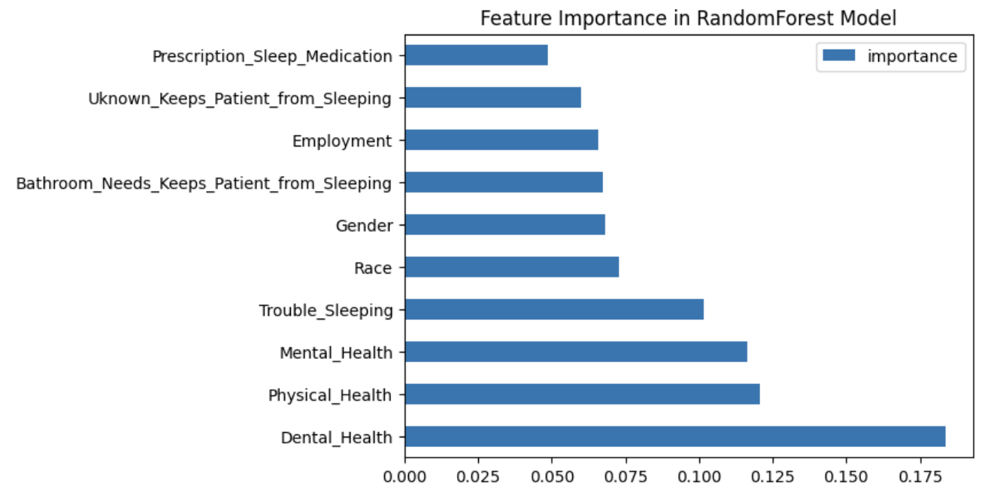

# Number of Doctor Visits Prediction

## Project Overview

The goal of this project is to develop a model using a machine learning algorithm to predict the number of doctor visits for patients aged 50 and older, categorizing these visits into predefined groups {1: 0-1 doctors, 2: 2-3 doctors, 3: 4 or more doctors } based on their physical, mental, and dental health status along with other lifestyle factors.

Our dataset for training includes 714 seniors, with variables such as health status, demographics, and lifestyle factors. Despite achieving a cross-validation accuracy of about 64%, the model's performance on unseen data was lower, at 41%, highlighting a need for further enhancements to ensure reliability in practical settings.

An important limitation to address is the imbalance in the 'race' feature within our dataset, coupled with the absence of 'age' as a considered factor, which could significantly impact the model’s predictive accuracy. Collecting more comprehensive data, including a broader demographic spread and additional age-related information, will be crucial in refining the model's effectiveness.

This may help healthcare planners and providers in optimizing the allocation of resources by forecasting healthcare demand variably across different patient groups. The model requires additional development to improve its accuracy and reliability for deployment in real-world healthcare scenarios.

See the [Model Implementation Code](https://github.com/mijinatdiscovery/NPHA-doctor-visits/blob/main/notebooks/Model%2BAnalysis.ipynb) for details.

## Data
This model was trained on a subset of [the National Poll on Healthy Aging (NPHA) dataset](https://archive.ics.uci.edu/dataset/936/national+poll+on+healthy+aging+(npha)), consisting of 714 records of seniors who responded to the NPHA survey. The features include 14 attributes related to health and sleep. There is information about race/ethnicity, gender, and age.

See the [Data Sheet](https://github.com/mijinatdiscovery/NPHA-doctor-visits/blob/main/data_sheet.md) for details.

## Model
We have trained a Random Forest classifier and Support Vector Machine (SVC), DecisionTree, LogisticRegression. 

Both RandomForest and SVC are capable of managing the high dimensionality inherent in the dataset, which includes a diverse range of variables from healthcare usage to lifestyle factors. 

In initial tests, the Random Forest model performed better compared to the other models.

Average Accuracy: 60.4% (reported as higher, but confusion matrix suggests lower effective accuracy)
Reported Accuracy: 41% as the effective accuracy, which reflects the proportion of total correct predictions across all classes.

See the [Model Card](https://github.com/mijinatdiscovery/NPHA-doctor-visits/blob/main/model_card.md) for details.

## Hyperparameter Optimization
We used BayesSearchCV to obtain the best parameters for the RandomFoestClassifier, SVC models.
Both RandomForest and SVC models showed better predictive accuracy and robustness than other models (LogisticRegression, DecisionTree) we tested.

**RandomFoestClassifier Best Hyperparameters**

n_estimators: 120

max_depth: 15

min_samples_split: 2

min_samples_leaf: 3

bootstrap: False

n_iter: 100

**SVC Best Hyperparameters**

C: 14.107513230637315

gamma: 10

kernel: rbf

n_iter: 100

When tuning hyperparameters for RandomFoestClassifier, there was a significant difference between the training score(0.65) and the test score(0.38). But as the value of the min_samples_split, min_samples_leaf parameters increases, the difference between the train score and the test score decreased.

When tuning hyperparameters for SVC, particularly with the inclusion of the polynomial kernel (poly), computational time increased significantly.

## Results
RandomForest, SVC has the highest training score. In terms of test accuracy, all are fairly the same.

In the precision, recall, and f1 scores, RandomForest generally shows balanced performance across classes but struggles with Class 1. SVC shows slightly better performance for Class 2, which is the majority class, it might be better at identifying more common scenarios.

SVC might offer better performance for the specific task but **RandomForest** would be a strong choice on the grounds of interpretability, computational efficiency, and **more balanced class performance**. These factors are crucial in healthcare applications. 

#### Random Forest
                         precision  recall   f1-score   

                  1         0.22      0.18      0.20       
                  2         0.53      0.51      0.52        
                  3         0.33      0.39      0.36        
     train accuracy                             0.64
      test accuracy                             0.41
  

#### Support Vector Machine
                         precision  recall   f1-score   

                  1         0.18      0.11      0.13       
                  2         0.51      0.57      0.54        
                  3         0.30      0.32      0.31        
     train accuracy                             0.62
      test accuracy                             0.41                   
  

#### Model Insights
The RandomForest model has identified several key predictors that influence the frequency of doctor visits among the elderly. The features deemed most critical, based on their importance scores, are outlined below in their order of impact: 

## Lessons Learned

1. Defining the problem: Understanding the feasibility of a machine learning solution begins with a clear definition of the problem.  By defining the purpose early on, we should be able to focus our efforts on gathering relevant data and selecting the right targets for a model.

2. Data-driven approach.

3. Choosing appropriate ML techniques: The selection process by the models' ability to handle a specific type of data and the ease of interpreting their outputs.

4. Oversampling with SMOTE to address issues related to imbalanced data: Imbalanced data can skew model predictions, leading to poor generalization on underrepresented classes.

5. Hands-on experience in the ML process: The end-to-end experience, from data preprocessing to model evaluation, provided hands-on insights into the machine learning lifecycle.

6. Analyzing model behaviour to avoid overfitting.

7. Model performance evaluation using key metrics such as accuracy, precision, recall, and F1-score.

## License
This project is licensed under the MIT [License](https://github.com/mijinatdiscovery/NPHA-doctor-visits/blob/main/LICENSE) see the LICENSE file for details

